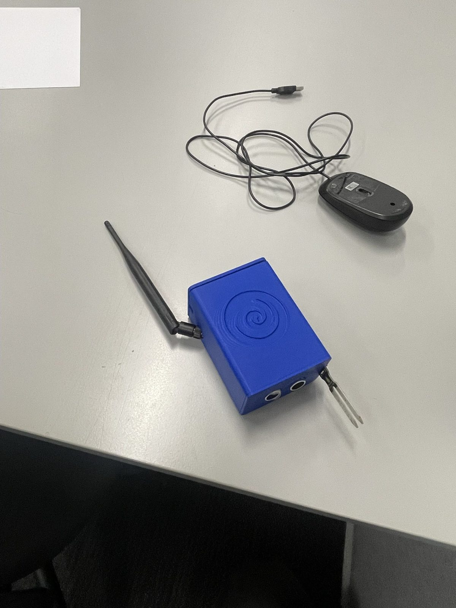
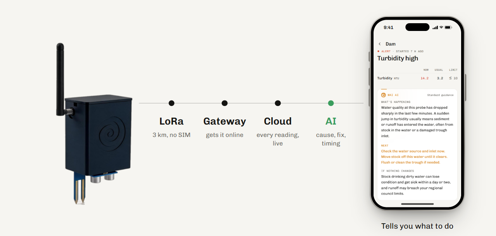
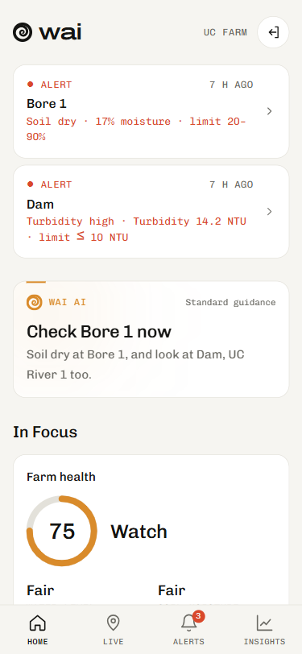
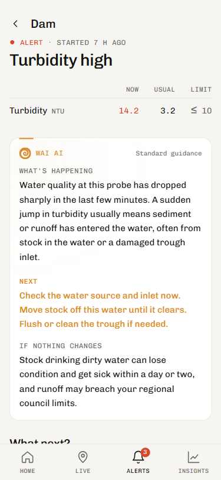
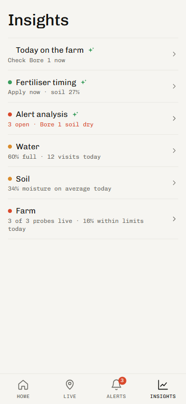
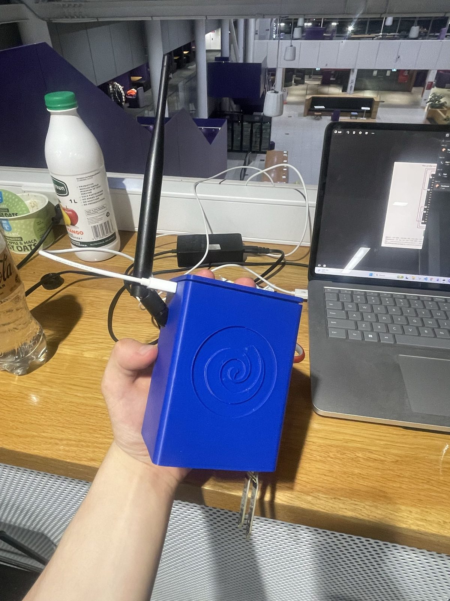

# Wai

The health monitor for your farm. It does the checking for you.

2nd at the OpenAI Hackathon. Mobile app, web app and the hardware, all demoed live. [trywai.now](https://trywai.now)

## Problem

- 2 h a day driving round the farm to check water and soil.
- +43% on fertiliser costs.
- $1M fine for run-off from fertilising before the rain.

## How it works

Probe → LoRa (no SIM) → gateway → cloud → AI.

Every reading lands live. The AI works out the cause, the fix and how long you've got.

## App

  
  
  

- Farm health score
- Wai AI: suggestions and insights on each probe's current readings
- Alerts: what changed, why, what to do, what it costs if you wait
- Map of probes, with health and battery
- Live readings from the real hardware

## Pricing

$99/month for the software, per device. Hardware is $0 upfront.

## Hardware

Probes chain over LoRa. Each one reaches 1 to 3 km to the next, so a string of them covers a whole farm with one gateway.

- ESP32
- LoRa radio, 923 MHz
- GPS
- Ultrasonic water level sensor
- Soil moisture probe
- 3D printed case
